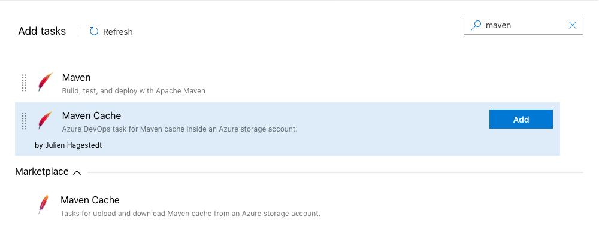
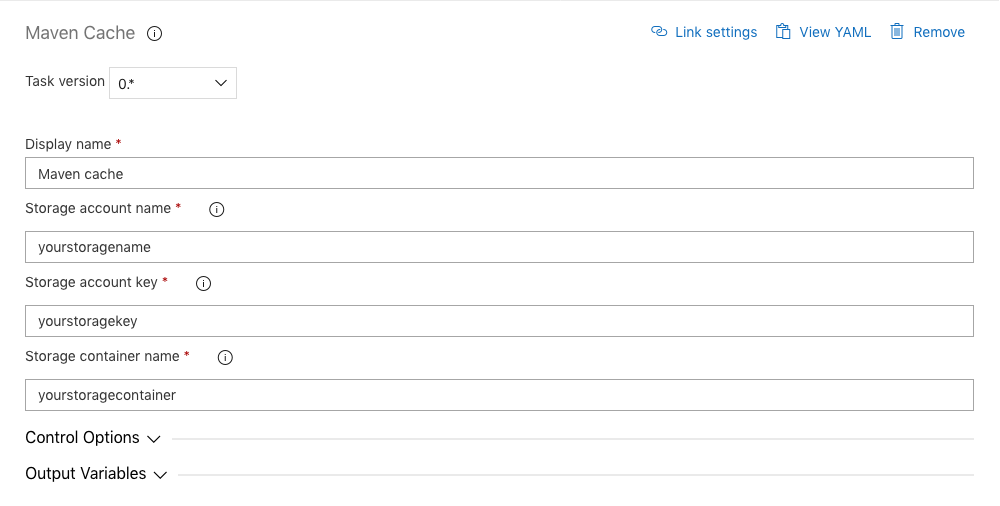

# Azure DevOps Maven Cache

With this plugin you are able to store and restore the local .m2 repository of your builds in an Azure storage account.
This saves build time up to **70%**.

## Info
An Azure storage account with blob support is required for this cache.

## Usage
Click on add task and search for **Maven Cache**.

Configure it as needed

Parameters:
- **Storage account name**: Type the name of your Azure storage account where you want to save the Maven cache.
- **Storage account key**: Type the access key of your Azure storage account.
- **Storage container name**: Type the container name that should be used inside your storage account. It will be created if it does not exist.

# Release notes

**0.1.6**
- Store description

**0.1.5**
- Initial public release